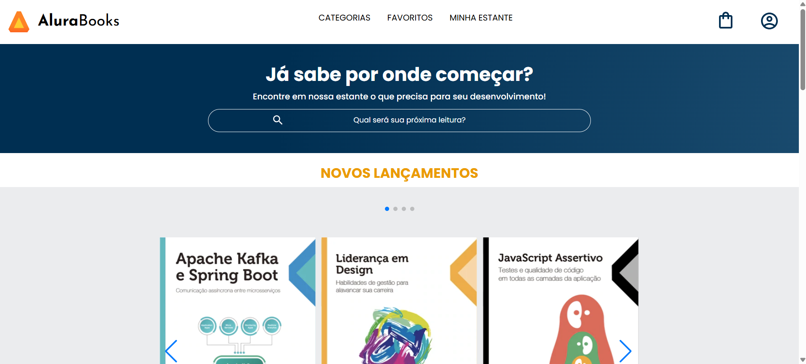

# 📚 Alura Books

Projeto desenvolvido como parte do curso de **Front-end** da [Alura](https://www.alura.com.br), utilizando **HTML5** e **CSS3**.

## 📌 Sobre o projeto
O **Alura Books** é uma página de livraria online fictícia, criada para praticar conceitos de HTML e CSS, como:
- Estruturação semântica de páginas
- Responsividade com Flexbox
- Estilização com CSS
- Organização de componentes visuais

## 🛠 Tecnologias utilizadas

  
  

## 📷 Prévia do projeto

## 📄 Licença
Este projeto foi desenvolvido apenas para fins educacionais.

